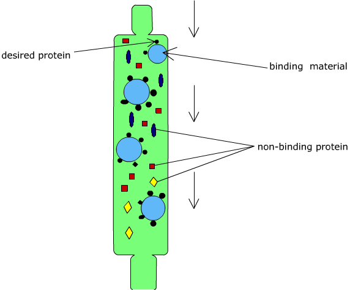
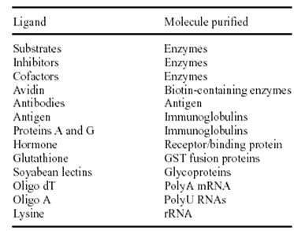
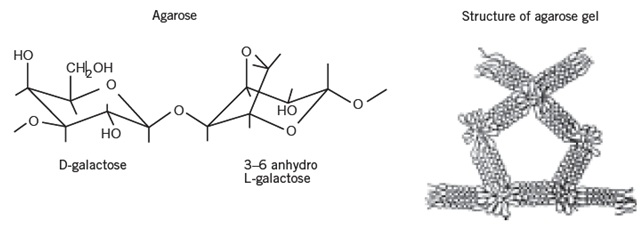
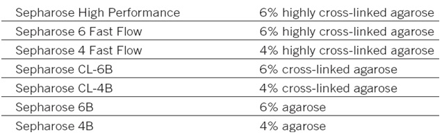
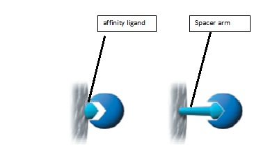
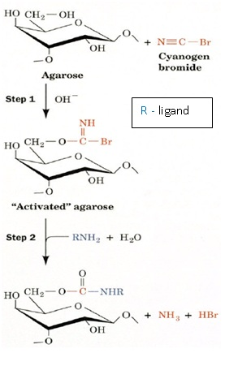

## Principle

&nbsp;
 

Affinity chromatography is unique in purification technology since it is the only technique that enables the purification of a biomolecules on the basis of its biological function or individual chemical structure. The method was developed  by Cuatrecasas P, Wilchek M,and Meir Wilchek for which the Wolf Prize in Medicine was awarded in 1987.

&nbsp;
 

Affinity chromatography separates proteins on the basis of a reversible interaction between a protein (and group of proteins) and a specific ligand coupled to a chromatographic matrix. Purification that would otherwise be time-consuming, difficult or even impossible using other techniques can often be easily achieved with affinity chromatography. The technique can be used to separate active biomolecules from denatured or functionally different forms, to isolate pure substances present at low concentration in large volumes of crude sample and also to remove specific contaminants. The technique offers high selectivity, hence high resolution, and usually high capacity for the protein of interest. Purification can be in the order of several thousand-fold and recoveries of active material are generally very high.

&nbsp;

Biological interactions between ligand and target molecule can be a result of electrostatic or hydrophobic interactions, van der Waals' forces and/or hydrogen bonding. To elute the target molecule from the affinity medium the interaction can be reversed, either specifically using a competitive ligand, or non-specifically, by changing the pH, ionic strength or polarity. The coupled ligand must retain its specific binding affinity for the target molecules and, after washing away unbound material, the binding between the ligand and target molecule must be reversible to allow the target molecules to be removed in an active form. Any component can be used as a ligand to purify its respective binding partner. A single pass of a serum or cell-lysate sample through an affinity column can achieve greater than 1000-fold purification of a specific protein so that only a single band is detected after gel electrophoresis (e.g., SDS-PAGE) analysis.

&nbsp;

                                                               

&nbsp; 

Some typical biological interactions, frequently used in affinity chromatography, are listed below

&nbsp;

                                                               

&nbsp; 

                                                                    

 

### Common terms in Affinity Chromatography
 

&nbsp;

 
**Matrix**

 

The matrix is an inert support to which a ligand can be directly or indirectly coupled. The list below highlights many of the properties required for an efficient and effective chromatographic matrix. 

1. Extremely low non-specific adsorption, essential since the success of affinity chromatography relies on specific interactions.
2. Hydroxyl groups on the sugar residues are easily derivatized for covalent attachment of a ligand, providing an ideal platform for the development of affinity media.
3. An open pore structure ensures high capacity binding even for large biomolecules, since the interior of the matrix is available for ligand attachment.
4. Good flow properties for rapid separation.
5. Stability under a range of experimental conditions such as high and low pH, detergents and dissociating agents.
Sepharose, a bead-form of agarose, provides many of the properties.

 

&nbsp;

                                                               

&nbsp; 
                                              

 

In affinity chromatography the particle size and porosity are designed to maximize the surface area available for coupling a ligand and binding the target molecule. A small mean particle size with high porosity increases the surface area. Increasing the degree of crosslinking of the matrix improves the chemical stability, in order to tolerate potentially harsh elution and wash conditions, and creates a rigid matrix that can withstand high flow rates. These high flow rates, although not always used during a separation, save considerable time during column equilibration and cleaning procedures.

&nbsp;

                                                               

&nbsp; 
 

                                                       

 

**Spacer Arm**

 

 It is used to improve binding between ligand and target molecule by overcoming any effects of steric hindrance. The binding site of a target protein is often located deep within the molecule and an affinity medium prepared by coupling small ligands, such as enzyme cofactors, directly to Sepharose may exhibit low binding capacity due to steric interference i.e. the ligand is unable to access the binding site of the target molecule. The spacer arm is a carbon chain interposed between ligand and supporting phase.

 

1. Used when active site is located deep within a sample molecule
2. If too long, it can interact with sample species on its own (London interactions)
3. If too short, ligand can’t reach active site on sample molecule.
                                                 

&nbsp;

                                                               

&nbsp; 
 

**Ligand**
 

Molecule that binds reversibly to a specific target molecule or group of target molecules. The ligand is the molecule that binds reversibly to a specific molecule or group of molecules, enabling purification by affinity chromatography. The selection of the ligand for affinity chromatography is influenced by two factors: the ligand must exhibit specific and reversible binding affinity for the target substance(s) and it must have chemically modifiable groups that allow it to be attached to the matrix without destroying binding activity. Interactions involving dissociation constants greater than 10-4 M, for example the binding reaction between an enzyme and a weak inhibitor, are likely to be too weak for successful affinity chromatography.

 

Binding buffer conditions are optimized to ensure that the target molecules interact effectively with the ligand and are retained by the affinity medium as all other molecules wash through the column.

&nbsp;
 

**Elution**
 

Buffer conditions are changed to reverse (weaken) the interaction between the target molecules and the ligand so that the target molecules can be eluted from the column.

 

**pH elution:**  A change in pH alters the degree of ionization of charged groups on the ligand and/or the bound protein. This change may affect the binding sites directly, reducing their affinity, or cause indirect changes in affinity by alterations in conformation. A step decrease in pH is the most common way to elute bound substances. The chemical stability of the matrix, ligand and target protein determines the limit of pH that may be used.

 

**Ionic strength elution:** The exact mechanism for elution by changes in ionic strength will depend upon the specificinteraction between the ligand and target protein. This is a mild elution using a buffer with increased ionic strength (usually NaCl), applied as a linear gradient or in steps.

 

**Competitive elution:** Selective eluents are often used to separate substances on a group specific medium or when the binding affinity of the ligand/target protein interaction is relatively high. The eluting agent competes either for binding to the target protein or for binding to the ligand.

 

**Reduced polarity of eluent:** Conditions are used to lower the polarity of the eluent promote elution without inactivating the eluted substances. Dioxane (up to 10%) or ethylene glycol (up to 50%) is typical of this type of eluent.

 

**Chaotropic eluents:** If other elution methods fail, deforming buffers, which alter the structure of proteins, can be used, e.g. chaotropic agents such as guanidine hydrochloride or urea. Chaotropes should   be avoided whenever possible since they are likely to denature the eluted protein.

&nbsp;
 

**Wash Buffer**
 

Conditions that wash unbound substances from the column without eluting the target molecules or that re-equilibrate the column back to the starting conditions (in most cases the binding buffer is used as a wash buffer).

&nbsp;
 

**Ligand Coupling**
 

Most commonly, ligands are immobilized or “coupled” directly to solid support material by formation of covalent chemical bonds between particular functional groups on the ligand (e.g., primary amines, sulfhydryls, carboxylic acids and aldehydes) and reactive groups on the support. However, indirect coupling approaches are also possible. For example, a GST-tagged fusion protein can be first captured to a glutathione support via the glutathione-GST affinity interaction and then secondarily chemically crosslinked to immobilize it. Groups on the stationary phase (usually agarose) require activation to render them chemically reactive. The main techniques used to achieve activation are cyanogen bromide activation.
 

&nbsp;

 

Pre-activated matrices: matrices which have been chemically modified to facilitate the coupling of specific types of ligand.

 

&nbsp;

                                                               

&nbsp; 
                                                              

 

 

### Affinity Chromatography Using Protein A Sepharose and Protein G Sepharose
 

The basis for purification of IgG, IgG fragments and subclasses is the high affinity of protein A (cell wall protein derived from Staphylococcus aureus ) and protein G( derived from groups C and G Streptococci )for the Fc region of polyclonal and monoclonal IgG-type antibodies. Protein A can be used to isolate monoclonal and polyclonal IgG from ascites, serum, and tissue culture and bioreactor supernatants. Protein A purification is recommended for human (except IgG3; mouse IgG1 may bind only weakly), rabbit, guinea pig, and pig antibodies. Addition  of the antibody to a protein A– Sepharose column at pH 8.0, followed by elution at a lower pH.

&nbsp;

Protein G has a binding profile opposite to that of protein A with respect to pH: antibodies bind better at a low pH and badly at high pH. However, some antibodies (mouse IgG1, and rabbit and human antibodies) do remain bound to protein G at high pH (8 to 10), so it is best to bind the antibody at pH 5 and elute at pH 2.8. This method is useful for mouse IgG1, rat (most subclasses bind weakly although IgG2b may not), monkey, rabbit, cow, goat, horse, and sheep antibodies.

&nbsp;

As with protein A purification, there is the possibility of some loss of antibody binding ability due to low-pH elution. Protein A Sepharose™ CL-4B is protein A immobilized by the CNBr method to Sepharose CL-4B. Protein A binds to the Fc region of immunoglobulins through interactions with the heavy chain. The binding of protein A has been well documented for IgG from a variety of mammalian species and for some IgM and IgA as well. Protein A Sepharose CL-4B has been used as a powerful tool to isolate and purify classes, subclasses and fragments of immunoglobulins from biological fluids and from cell culture media. Since only the Fc region is involved in binding, the Fab region is available for binding antigen. Hence, Protein A Sepharose CL-4B is extremely useful for isolating of immune complexes.

&nbsp;

 

A wide variety of prepacked columns, ready to use media, and pre-activated media for ligand coupling through different functional groups, makes affinity chromatography readily available for a broad range of applications. The HiTrap™ column range is excellent for routine laboratory scale applications in which the risk of cross-contamination between samples must be eliminated, for purification from crude samples or for fast method development before scaling up purification. HiTrap columns can be operated with a syringe, a peristaltic pump or any ÄKTA™design chromatography system.

&nbsp;
 

**Fraction Collector:** A fraction detector is a device that allows regular or specified samples to be taken from a column eluate and stored in a retrievable form. The storage vessels are usually small sample tubes or vials that are oriented in a rotating disk or in a moving belt, their movement usually being controlled by a microprocessor.

&nbsp;
 

On receiving a signal from the microprocessor, the next vial is placed under the column outlet and the eluate collected until receiving another signal from the computer. Once the properties of the chromatogram that describes the separation has been ascertained, then the collection program can be defined. The fractions can be collected on a basis of time either at regular intervals or specific times to collect specific peaks.

 
&nbsp;

Alternatively the fractions can be collected by monitoring the detector output and when a peak starts to elute the fraction collector is activated and the peak collected in a specific vial. When the peak returns to base line the column eluate is then directed to waste until the next peak starts eluting. Fraction collectors are in common use with most liquid chromatographs. They are used to collect samples for further purification, subsequent examination by spectroscopic techniques.
